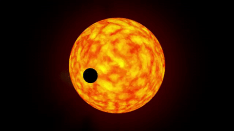

<p align="center"></p>

<h1 align="center">Exoplanet</h1>

 
 <h3 align="center">
API REST de código aberto para dados de consulta de  pesquisa  as informações nela contida  foi desenvolvida usando como base de dados as informações contidas na <a href="https://www.nasa.gov/subject/6893/nebulae/" target="_blank">NASA</a>
 obtendo valores do acervo <a href="https://chandra.harvard.edu/photo/2007/orion/" target="_blank">The Exoplanet Archive's </a> usando como base organizacional um sistema de exibição de exoplanetas registrados pelo elescopio kepler
<p align="center">
 
 
<a href="https://www.travis-ci.com/github/Mario23junior/Api-Nebulosas/pull_requests" target="_blank">
<a href="https://en.wikipedia.org/wiki/Representational_state_transfer"></a>
</p>

## Resultado dos dados da API

```json


```
